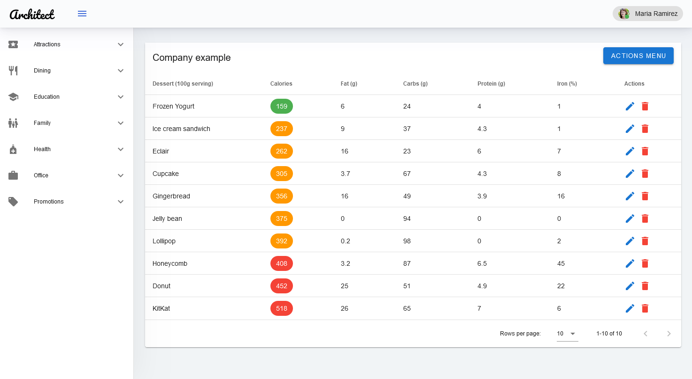

## ArchitectUI Admin Dashboard | Unofficial Vue version with Vuetify 2

## Descripcion
Dashboard es una estructura de plantilla web creada con Vue.js y Vuetify que facilita la concentración en la lógica de negocio a los programadores sin dejar atrás la importancia de la experiencia de usuario.
## Instalacion

Antes de ejecutar la aplicación, asegúrate de que tienes las siguientes version de de nodejs:v18.16.1
1. Clonar el repositorio:

```bash
git clone git@github.com:BalmoreRamirez/template-dashboard-vuejs.git
```

2. Navegue hasta el directorio del proyecto:

```bash
cd template-dashboard-vuejs
```

3. Instalar las dependencias:

```bash
npm install
```

## Utilización

### Servidor de desarrollo

Para ejecutar el servidor de desarrollo, utilice el siguiente comando:
```bash
npm run serve
```
El servidor de desarrollo estará accesible en `http://localhost:8080`.

### Compilar el Proyecto a produccion

Para compilar el proyecto para producción, utilice el siguiente comando:
```bash
npm run build
```
## Dependencias

- vue: 2.6.14
- vue-router: 3.6.5
- vuetify: 2.6.0

## Licencia

Este proyecto está bajo la licencia MIT.

## Contacto

Para cualquier consulta o pregunta, por favor contáctanos a través de [correo electrónico](mailto:camaleoncode@gmail.com) o visita nuestro sitio web en [https://balmoreramirez.netlify.app/](https://balmoreramirez.netlify.app/).
